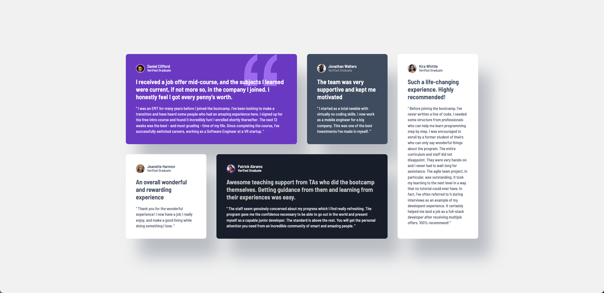

# Frontend Mentor - Testimonials grid section solution

## Table of contents 目錄

- [Overview 概述](#overview-概述)
  - [The challenge 挑戰目標](#the-challenge-挑戰目標)
  - [Screenshot 截圖](#screenshot-截圖)
  - [Links 相關連結](#links-相關連結)
- [My process 我的過程](#my-process-我的過程)
  - [Built with 使用技術](#built-with-使用技術)
  - [What I learned 學習心得](#what-i-learned-學習心得)
- [Author 作者](#author-作者)

## Overview 概述

### The challenge 挑戰目標

Users should be able to:
使用者應該能夠：

- View the optimal layout for the site depending on their device's screen size
- 根據裝置的螢幕大小查看最佳的網站布局

### Screenshot 截圖



### Links 相關連結

- Solution URL 解決方案網址: https://github.com/ylin320/Testimonials-grid-section
- Live Site URL 網站連結: https://ylin320.github.io/Testimonials-grid-section/

## My process 我的過程

### Built with 使用技術

- Semantic HTML5 markup
- CSS custom properties
- Flexbox
- CSS Grid
- Mobile-first workflow

### What I learned 學習心得

During this project, I had more opportunities to work with CSS Grid and learned several interesting techniques:

在這個項目中，我有更多機會使用 CSS Grid 並學習到許多有趣的技巧：

1. **Grid Template Areas**
   - I discovered how powerful and intuitive grid-template-areas can be for layout design
   - 我發現 grid-template-areas 在布局設計上非常強大且直觀

```css
.feedback-grid {
  grid-template-columns: repeat(4, 1fr);
  grid-template-areas:
    "grid-1 grid-1 grid-2 grid-5"
    "grid-3 grid-4 grid-4 grid-5";
}

.grid-1 {
  grid-area: grid-1;
  background-image: url(./images/bg-pattern-quotation.svg);
  background-repeat: no-repeat;
  background-position: top right 4rem;
}
```

2. **Spacing with CSS Variables**
   - Learned to use CSS variables and calc() for more precise spacing calculations
   - 學習使用 CSS 變數和 calc() 進行更精確的間距計算

```css
:root {
  --space-unit: 8px;
  --space-xs: calc(var(--space-unit) * 0.5); /* 4px */
  --space-sm: var(--space-unit); /* 8px */
  --space-md: calc(var(--space-unit) * 2); /* 16px */
  --space-lg: calc(var(--space-unit) * 3); /* 24px */
  --space-xl: calc(var(--space-unit) * 4); /* 32px */
}

.feedback-grid {
  gap: var(--space-xl);
}
```

3. **Background Properties**
   - Gained deeper understanding of background image handling
   - 對背景圖片處理有了更深入的理解

```css
.grid-1 {
  background-image: url(./images/bg-pattern-quotation.svg);
  background-repeat: no-repeat;
  background-position: top right 4rem;
}
```

4. **Responsive Layout Structure**
   - Enhanced my understanding of responsive design using grid areas
   - 增進了對使用格線區域的響應式設計理解

```html
<main class="feedback-grid">
  <article class="feedback-card grid-1">
    <div class="feedback-header">
      <div class="author-profile">
        
        <div class="author-info">
          <h3 class="author-name">Daniel Clifford</h3>
          <p class="author-status">Verified Graduate</p>
        </div>
      </div>
    </div>
  </article>
</main>
```

## Author 作者

- GitHub - [@ylin320](https://github.com/ylin320)
- Frontend Mentor - [@ylin320](https://www.frontendmentor.io/profile/ylin320)
